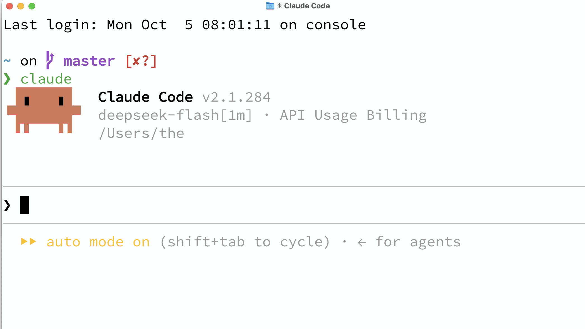
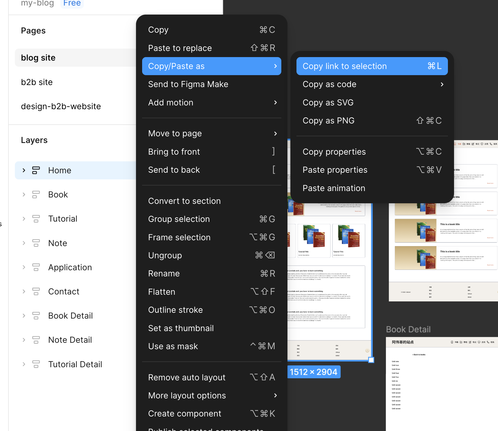

# 记录vibe coding个人博客网站

简介：这是一个编程小白，在AI时代，利用claude code来vibe coding的第一个项目，全程属于摸石头过河，从简单的blog网站开始，学习AI，一上手就做真项目，自己就能用的项目。建立这个blog网站，一是自己真的需要，刚好可以记录我的学习笔记，各种教程，还有我正在写的书（哈哈，虽然还没写完，看着还有点幼稚）；二是blog网站简单，适合我这个0基础小白从头开始做。


## 1、准备好设计

网站要设计成什么样，有人认为blog网站简单，直接输入提示词，让claude code自己去做，不管它生成什么样的样式，能用就行。但我决定还是自己从设计开始，走完整个流程，以后逐步提高项目难度。

关于网站设计，我采用热门的设计软件Figma，下载了桌面版。这也是我第一次用，在b站上我看了一集30分钟的快速入门教程。先了解基本概念，至于样式细节，我不必太花时间，以后有时间可以深入，把简单网站先设计起来。b站的那个教程如下，有需要的可以看看，了解frame，auto layout，padding，margin， gap， fill，stroke，effect，component等等。对于我入门画个简单网站，够用了。

```url
https://www.bilibili.com/video/BV1QzADeFEcF/?spm_id_from=333.1391.0.0&vd_source=9c1a07ba1e8bc6642d15cdcf4d33c66a
```

看起来简单，等我自己动手画的时候，发现还是有困难，于是我又重新看了上面的教程。就这样，我花了一天时间，画了blog网站的设计稿。地址如下，清晰记录着我来时的路（哈哈）。

```
https://www.figma.com/design/kA4iT3KfstvmU1sPqrxbRw/web-design?node-id=34-683&t=dCqlqrazK5zrdTIj-1
```


## 2、准备好AI工具

我下载了claude code cli。因为听说它不仅有最好的大模型，也是最好的调度工具。打开claude code官网。

```bash
https://claude.com
```

安装Claudecode cli。我是Mac，采用terminal的安装方式

```
curl -fsSL https://claude.ai/install.sh | bash
```

但是因为它对中国封禁，网络，付款之类的十分麻烦，所以决定用deep seek模型代替。 我用自己的手机号注册了deepseek api开放平台，充值了20（试试水），创建了api key。

```
https://platform.deepseek.com/api_keys
```

之后，找到接口文档，将deep seek模型接入claude code。

```
https://api-docs.deepseek.com/zh-cn/quick_start/agent_integrations/claude_code
```

复制下面这段配置，在terminal中执行，自己配置到环境变量中。

```bash
export ANTHROPIC_BASE_URL=https://api.deepseek.com/anthropic
export ANTHROPIC_AUTH_TOKEN=<你的 DeepSeek API Key>
export ANTHROPIC_MODEL=deepseek-flash[1m]
export ANTHROPIC_DEFAULT_OPUS_MODEL=deepseek-flash[1m]
export ANTHROPIC_DEFAULT_SONNET_MODEL=deepseek-flash[1m]
export ANTHROPIC_DEFAULT_HAIKU_MODEL=deepseek-flash
export CLAUDE_CODE_SUBAGENT_MODEL=deepseek-flash
export CLAUDE_CODE_EFFORT_LEVEL=max
export CLAUDE_CODE_AUTO_COMPACT_WINDOW=786432
```

或者，我在~/.claude/settings.json中配置。如果两个都配置，优先读取settings.json。

```json
 "env": {
    "ANTHROPIC_AUTH_TOKEN": "<你的 DeepSeek API Key>",
    "ANTHROPIC_BASE_URL": "https://api.deepseek.com/anthropic",
    "ANTHROPIC_DEFAULT_HAIKU_MODEL": "deepseek-flash",
    "ANTHROPIC_DEFAULT_OPUS_MODEL": "deepseek-flash[1m]",
    "ANTHROPIC_DEFAULT_SONNET_MODEL": "deepseek-flash[1m]",
    "ANTHROPIC_MODEL": "deepseek-flash[1m]",
    "CLAUDE_CODE_AUTO_COMPACT_WINDOW": "786432",
    "CLAUDE_CODE_DISABLE_EXPERIMENTAL_BETAS": "1",
    "CLAUDE_CODE_EFFORT_LEVEL": "max",
    "CLAUDE_CODE_SUBAGENT_MODEL": "deepseek-flash"
  },
```


这些配置好后，打开terminal，任意一个项目下，我输入claude，启动claude code.




## 3、技术选型

我在电脑上新建一个文件夹，项目名称为my-web。打开terminal，cd到这个目录。输入claude，打开了claude code cli。

一开始，我没直接动手，而是打开网页版deepseek，问开发流程。AI给我的答案是先技术选型，再建立一个CLAUDE.md。技术选型这一步，我是不太懂技术的，后来我想，以后我可以直接在claude code中问，它会帮我选型。

总之，考虑到这是一个博客网站，上传的都是markdown格式的纯文本，AI给我答复说用Astro框架来做。之后，我说出网站需求，它帮我生成CLAUDE.md，具体内容如下。CLAUDE.md的作用是让claude code知道整个开发过程中知道自己做什么，保持行为一致。

~~~markdown
# Project: My Personal Blog

Astro static blog. Deploys to GitHub Pages via GitHub Actions.
Follow Figma design to develop this website.

## Commands

- `yarn dev`: Start dev server (port 4321)
- `yarn build`: Production build
- `yarn preview`: Preview built site
- `yarn add <pkg>`: Add a dependency

## Architecture

- `src/pages/` → Routes (file-based routing)
- `src/layouts/` → Page layouts
- `src/components/` → Reusable components
- `src/content/` → Blog posts (Markdown)
- `public/` → Static assets

## Conventions

- Use `.astro` components. No React/Vue unless explicitly requested.
- Blog posts live in `src/content/blog/` with frontmatter: title, date, description.
- Styling: Use scoped `<style>` in `.astro` files. No Tailwind unless added.

## Gotchas

- `yarn build` outputs to `dist/`
- Never edit files in `dist/` — it's generated


<!-- ## Development

When starting the dev server, use background mode:

```
astro dev --background
``` -->

<!-- Manage the background server with `astro dev stop`, `astro dev status`, and `astro dev logs`. -->

## Documentation

Full documentation: https://docs.astro.build

Consult these guides before working on related tasks:

- [Adding pages, dynamic routes, or middleware](https://docs.astro.build/en/guides/routing/)
- [Working with Astro components](https://docs.astro.build/en/basics/astro-components/)
- [Using React, Vue, Svelte, or other framework components](https://docs.astro.build/en/guides/framework-components/)
- [Adding or managing content](https://docs.astro.build/en/guides/content-collections/)
- [Adding styles or using Tailwind](https://docs.astro.build/en/guides/styling/)
- [Supporting multiple languages](https://docs.astro.build/en/guides/internationalization/)

```
~~~


## 4、准备开发环境

不只是准备claude code，还要准备node环境，以及包管理工具yarn，（后面的项目我又替换成了pnpm）。这是前端开发需要依赖的环境。都是在官方文档看的安装教程，这里就不提安装过程了。（这步一步可以让claude code帮你安装。）

我打开Astro框架官方文档，在terminal中创建了一个astro项目。（其实这步也可以让AI帮我做，但是当时不懂）

```bash
yarn create astro
```

之后按照它的提示，一路选择yes。


## 5、动手开发

在terminal中，输入claude，就进入cli画面，可以直接对话了。我第一步是说：

```bash
read CLAUDE.md first, then let's get started.
```

它大概阅读了一分钟，之后输出一段话，大意就是它明白任务是什么。我打开我的figma设计，之后在又对着claude code说：

```
let's develop home page according to figma design, figma is: xxxxx 
```

这里是你figma设计的链接，如下图所示，先选中你要开发的layer，再右键, 在copy/paste as中选择copy link to selection,如下图所示)



之后，figma就一顿操作，中途偶尔会给你一些选择，不要害怕，看清楚它的提示，一般它会给你最优的选项，你就按enter。

这里会有个问题：它会把代码完全写死，完全按照你的figma设计稿来，比如那些临时的图片，这只是占位用的，需要后期根据你自己上传的图片来动态展示。这时候你直接跟claude code说：

```
about the books and pictures, don't be remain static, just fetch it from /src/content.
```

也就是说你把这些要上传的文件放在这些目录下就行，cc会帮你展示。

其他页面依葫芦画瓢，依次开发。


## 6、使用worktree开发

开发过程中，遇到的另一个问题是，如果去修理bug，会把之前处理好的代码弄混，这时候你需要用claude的worktree来开发。这是基于git的，至于什么是git，简单来说，是管理代码分支的。

Git worktree 允许你在**同一个仓库**下创建多个独立的工作目录，每个目录检出不同的分支，共享同一个 `.git` 对象库。在 Claude Code 的语境下，它的价值在于**文件级隔离**：每个会话在自己的目录里编辑文件，不会干扰其他会话的工作。也就是说，多个worktree之间互不干扰，你可以做自己的事情，最后将它们合并在一起。

至于详细的，以及如何安装，需要自己去AI掌握。

我安装好git好，在claude code中使用以下命令，创建worktree。

```bash
claude --worktree feature-navbar 
```

上面这个worktree叫feature-navbar，是专门开发导航栏的。你还可以同时多几个worktree，比如feature-footer，可以同时开发footer部分，两个处理不同文件，不影响。每个worktree开发完后，对cc说：

```bash
commit and merge into master
```

它会自动帮你合并到master分支（git内容，需要你去学习下）。

就这样，几个页面，花了我一天多的时间，再摸索中完成了。我跑到github网站，注册了个账号。（一个基于git的专门用于代码托管的网站，需要你自己去了解）

```
https://github.com/
```

我对cc说：

```bash
push to github
```

它会将你的代码推送到github平台。


## 7、部署上线

开发的项目还在我的本地，其他人访问不到。如果其他人要访问你的网站，你需要部署上线。这里我选择了免费的cloudflare。我先去注册了cloudflare账号。

```
https://dash.cloudflare.com/login
```

账号注册好之后，我对cc说：

```bash
deploy to cloudflare
```

它会帮你处理好，这期间它会自动安装一些工具，总之自动帮你完成。最后返回一个domain，就是你网站的访问地址。我的blog地址是：

```
https://my-web.18820954882.workers.dev/
```

这是cloudflare的domain，在中国不能访问（需要科学上网），想要你自己去买个domain，在cloudflare的后台，点进去你的项目，有Domains菜单栏，里面可以自定义你的domain。替换后，中国ip也能访问。


## 8、结论

虽有波折，但好在都被AI解决了（哈哈）。不得不感叹AI太强大，以前的我，是不可能开发出一个网站的，哪怕是简单的那种。现在我可以自己用AI开发自己想要的工具。以后就剩完善了，逐步开发难度高的项目。